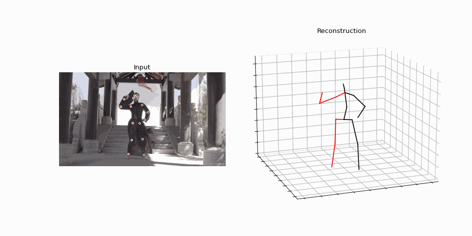

# FYP
This is for FYP Curtin University Y2T2 2021.
## Webapp development for sport gait analysis

### 3.4.3  Wild environment: Ice Skating

### 3.4.4  Wild environment: Standing

### 3.4.5  Wild environment: Dancing

